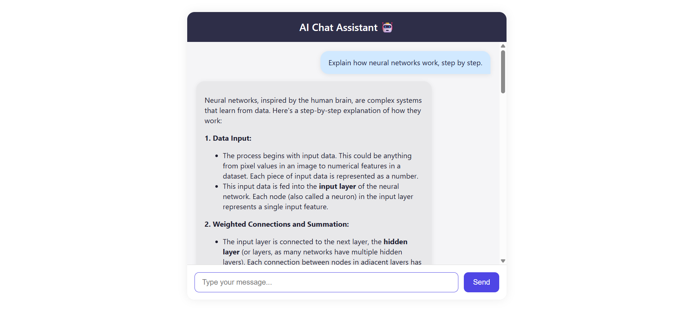

# 💬 AI Chatbot Assistant (Gemini-Powered)

A full-stack chatbot web application built with **React**, **Node.js**, and the **Google Gemini API**. Users can chat in real-time with an AI assistant through a clean, modern, and responsive UI.

---

## 📸 UI Preview

> 

---

## 🚀 Features

- ✅ Interactive chat interface with real-time responses
- 🧠 Google Gemini API integration (free tier)
- 🧼 Clean, mobile-first design using vanilla CSS
- 🔄 Enter-to-send + click-to-send input
- ⚡ Fast backend with Express.js
- 🔐 API key stored securely using `.env`

---

## 🛠️ Tech Stack

| Layer     | Tech          |
|-----------|---------------|
| Frontend  | React + CSS   |
| Backend   | Node.js + Express |
| AI API    | Google Gemini (gemini-1.5-flash) |
| Deployment | Run locally |

---

## 🧪 Setup Instructions

### 📦 Backend
```bash
cd backend
npm install
````

Create a `.env` file in `backend/`:

```env
GEMINI_API_KEY=your_gemini_api_key_here
```

Start the server:

```bash
node index.js
```

### 💻 Frontend

```bash
cd frontend
npm install
npm start
```

---

## 🔗 API Reference Ex:

### `POST /api/chat`

#### Request 

```json
{
  "message": "Tell me a joke"
}
```

#### Response

```json
{
  "response": "Why don't scientists trust atoms? Because they make up everything!"
}
```

## 📁 Folder Structure

```
ChatApp/
├── backend/
│   ├── routes/
│   ├── services/
│   └── index.js
├── frontend/
│   ├── src/
│   │   ├── Pages/chat.js
│   │   ├── CSS/Chat.css
│   │   └── App.js
│   └── public/
├── README.md
```

---

## ⚠️ Assumptions & Limitations

* Only supports **text input/output**
* No multi-turn conversation memory (stateless)
* Gemini API must be manually configured in `.env`
* Chat resets on page refresh (no DB or auth)

---

## 👨‍💻 Developed By

**Mohammed \[Asardeen Azees]**
